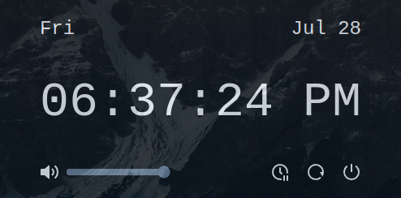

# edash

An `Electron` extendable dashboard concept using `SolidJS` and `TailwindCSS`.

> **Use [tdash](https://github.com/mageic-dev/edash) instead. Tauri is much more efficient than Electron.**

Currently has:

- Date and time
- Power management buttons (Suspend, Reboot, Shutdown)
- Volume control



## Testing

```sh
npm run start

# test on browser
npm run dev

# running directly from electron
electron .
```

## Dependencies

Arch Linux:

```sh
pacman -S electron
```

## Building standalone app package

TODO

## Using with i3wm

Using a hotkey keybinding in i3wm to display date/time in floating scratchpad. The idea is put components here instead of an always-present bar on top.

Add to i3 config (`~/.config/i3/config`):

```
exec --no-startup-id electron --class="dash" ~/projects/edash
for_window [class="dash"] floating enable, resize set 500px 250px, border pixel 5, move scratchpad, move absolute position center
bindsym $mod+grave [class="dash"] scratchpad show, move absolute position center
```

Replace path to directory and adjust hotkey as needed.
